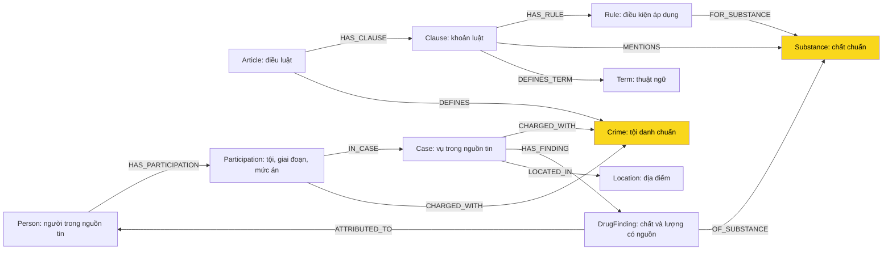

# Thiết kế Ontology — Day 19

**Họ tên:** Phạm Hoàng Trọng — **MSSV:** 2A202602765

**Lựa chọn:**

- [ ] Dùng ontology gợi ý
- [x] Tự thiết kế dựa trên dữ liệu; đã có triển khai và benchmark đối chứng để xét bonus

**Trạng thái:** đã triển khai bốn entry point trong `src/graph.py`, phần ontology trong `src/graph_ontology.py`. Test gốc và regression bổ sung đã pass; `--check` đạt đủ 7 dòng OK. Số liệu và context của graph đầy đủ được lưu ở `graph_contexts.json`; benchmark dùng `ket_qua_benchmark_kg.txt` và bản đối chứng `.hint.txt`.

Căn cứ: [ghi chép Bước 1](STEP1_DATA_REVIEW.md), [benchmark](../data/benchmark_kg.json), luật và tin trong repo. Khung hình phạt được hiểu theo phiên bản văn bản của bộ dữ liệu lab.

Mục tiêu: nối người/vụ với đúng tội và điều luật; bảo toàn nguồn, giai đoạn và mức án; đối chiếu ngưỡng MDMA ở Q5; tổng hợp vụ ở Q6. Không biến mọi danh từ thành node.

## 1. Sơ đồ



Crime là cầu nối chính; Substance là cầu bổ trợ. Khung hình phạt nằm trên Clause, mức án thực tế nằm trên Participation; chúng không phải cùng một dữ kiện.

## 2. Entity types và định danh

| Label | Ý nghĩa | Khóa MERGE | Properties chính | KB | Trích xuất |
| --- | --- | --- | --- | --- | --- |
| Article | Điều thuộc một phiên bản luật | `id = doc_id + ':article'` | `name`, `number`, `law`, `version`, `title`, `doc_id`, `source_url` | Luật | Metadata + regex |
| Clause | Khoản thuộc điều | `id = article.id + ':clause:' + number` | `number`, `text`, `penalty_text`, `penalty_kind`, `prison_min_years`, `prison_max_years`, `life_allowed`, `death_allowed`, `doc_id` | Luật | Regex + phân tích mẫu hình phạt |
| Rule | Điều kiện/điểm thuộc khoản | `id = clause.id + ':rule:' + point_key` | `point`, `text`, `quantity_kind`, `min_value`, `max_value`, `min_inclusive`, `max_inclusive`, `unit`, `parse_status`, `doc_id` | Luật | Regex; không hiểu thì giữ text |
| Crime | Tội danh chuẩn | `id = mã văn bản + ':crime:' + số điều` | `name`, `aliases`, `source_doc_ids` | Cả hai | Tiêu đề luật; LLM tin + linking |
| Substance | Chất/nhóm chất chuẩn | `id` từ từ điển kiểm soát | `name`, `aliases`, `category`, `source_doc_ids` | Cả hai | Từ điển + regex luật; LLM tin |
| Case | Vụ được một nguồn tin mô tả | `id = doc_id + ':case:' + local_key` | `name`, `summary`, `canonical_case_id`, `identity_status`, `doc_id`, `source_url` | Tin | LLM; code xác định khóa |
| Person | Người được một nguồn tin nhắc tới | `id = doc_id + ':person:' + normalized_full_name` | `name`, `aliases`, `canonical_person_id`, `identity_status`, `doc_id` | Tin | LLM + đối chiếu bí danh |
| Participation | Ghi nhận người/vụ/giai đoạn/tội | `id = case.id + ':participation:' + person_key + ':' + fact_key` | `role`, `stage`, `status`, `charge_raw`, `sentence_text`, `sentence_months`, `sentence_kind`, `event_date`, `date_text`, `evidence_text`, `doc_id` | Tin | LLM JSON + kiểm tra |
| DrugFinding | Ghi nhận chất/lượng có nguồn và phạm vi | `id = case.id + ':finding:' + fact_key` | `amount_text`, `value`, `unit`, `quantity_kind`, `qualifier`, `scope`, `stage`, `event_date`, `evidence_text`, `doc_id` | Tin | LLM lấy nguyên văn; code đổi đơn vị |
| Term | Thuật ngữ luật giải thích | `id` theo tên thuật ngữ chuẩn | `name`, `aliases`, `source_doc_ids` | Luật | Regex; định nghĩa nằm trên cạnh và Clause |
| Location | Địa điểm định danh theo ngữ cảnh | `id = tên chuẩn + cấp + địa phương cha` | `name`, `aliases`, `level`, `parent_name`, `source_doc_ids` | Tin | LLM + đối chiếu địa danh |

### Khóa và nguồn

- Tạo constraint UNIQUE trên `id` của cả 11 label. Không MERGE theo summary hay tên vụ tự đặt.
- Node thuộc một tài liệu có `doc_id = Document.id`. Crime/Substance/Term/Location dùng chung giữ tập `source_doc_ids`, không lấy một doc_id tùy ý rồi ghi đè.
- local_key/fact_key do code tạo từ trường chuẩn hóa và neo bằng chứng bằng hàm băm ổn định; không dùng số ngẫu nhiên hoặc `hash()` thay đổi theo tiến trình. Loại trùng ghi nhận trong một bài; khác tội, người, giai đoạn hoặc phạm vi lượng phải giữ riêng.
- Khi trích tin, đánh mã các đoạn nguồn S0001… để LLM chọn; code khôi phục nguyên văn vào evidence_text. Nếu LLM trả quote trực tiếp thì quote vẫn phải tồn tại trong nguồn. Như vậy evidence lưu trong graph là văn bản thật, không phải lời diễn đạt lại của LLM.
- Case/Person là bản ghi theo nguồn. canonical_case_id/canonical_person_id nhóm các bản ghi đã xác minh là cùng vụ/người, ban đầu bằng bảng đối chiếu kiểm soát từ corpus. Không dùng tên vụ do LLM đặt làm căn cứ duy nhất.
- Chưa đủ bằng chứng: canonical ID bằng ID cục bộ, identity_status='unresolved'. Cùng tội và cùng thành phố chưa đủ gộp vụ; cùng tên Tuấn chưa đủ gộp người. Việc giữ nhiều bản ghi theo nguồn là chủ đích; Q6 nhóm theo canonical ID, không đếm số node Case.

### Giá trị có cấu trúc

- stage: investigation, prosecution, first_instance, appeal, unknown. status: alleged, charged, convicted, withdrawn, unknown, căn cứ nguyên văn nguồn. Người liên quan không tự động có tội.
- sentence_kind: fixed_term, life, death, unknown. Chưa có án thì sentence_months=null, không phải 0. Sự kiện hoãn phúc thẩm không ghi đè án sơ thẩm.
- penalty_kind: principal, supplementary, definition, other. Khung “20 năm, chung thân hoặc tử hình” có prison_max_years=20, life_allowed=true, death_allowed=true. Khoản không có hình phạt không gán 0 năm.
- Chuẩn khối lượng về g, thể tích về ml; quantity_kind phân biệt mass/volume/count. “5 viên”, “5 ống”, “nửa chỉ” không đổi ra gam khi thiếu căn cứ.
- qualifier: exact, greater_than, at_least, less_than, approximate, unknown. “Hơn 9,6kg” → value=9600, unit='g', qualifier='greater_than'; giữ amount_text gốc.
- Ngưỡng “từ 05 gam đến dưới 30 gam” → [5,30); “100 gam trở lên” → [100,+∞). Điều kiện hỗn hợp hoặc chưa phân tích được giữ text, parse_status='text_only', không đoán số.
- scope: person_total, shipment, case_total, operation_total, unknown. Không cộng tổng với lượng từng đợt; hơn 1.000 đầu pod toàn chuyên án không gán riêng cho Hoàng Nato.
- Nếu bằng chứng nói rõ “trong chuyên án”, ép scope=operation_total và bỏ quy thuộc theo người. ATTRIBUTED_TO chỉ tạo khi đoạn bằng chứng nhắc tên/bí danh hoặc tên ngắn duy nhất của người trong vụ; thiếu căn cứ thì bỏ cạnh, person_total chuyển unknown.
- Ngày chỉ chuyển ISO khi đủ căn cứ năm/tháng/ngày; giữ date_text và null khi chưa rõ. Không dùng ngày crawl làm ngày vụ việc.

## 3. Relationships

| Type | Từ → Đến | Properties cạnh | Ý nghĩa |
| --- | --- | --- | --- |
| HAS_CLAUSE | Article → Clause | — | Điều chứa khoản |
| DEFINES | Article → Crime | — | Điều định nghĩa tội |
| HAS_RULE | Clause → Rule | — | Khoản chứa điều kiện |
| FOR_SUBSTANCE | Rule → Substance | — | Điều kiện lượng liên quan chất/nhóm chất |
| MENTIONS | Clause → Substance | — | Chỉ mục tìm khoản theo chất từ văn bản |
| DEFINES_TERM | Clause → Term | definition_text | Định nghĩa thuật ngữ |
| HAS_PARTICIPATION | Person → Participation | — | Ghi nhận của người có nguồn |
| IN_CASE | Participation → Case | — | Ghi nhận thuộc vụ |
| CHARGED_WITH | Participation → Crime | link_method | Tội gắn với stage/status, không mặc định đã kết án |
| CHARGED_WITH | Case → Crime | derived=true | Chỉ mục hợp các tội được liên kết từ Participation; không gán cho mọi người |
| HAS_FINDING | Case → DrugFinding | — | Ghi nhận chất/lượng trong vụ |
| OF_SUBSTANCE | DrugFinding → Substance | — | Chất của ghi nhận |
| ATTRIBUTED_TO | DrugFinding → Person | basis | Nguồn quy thuộc lượng cho người: trách nhiệm hình sự/sở hữu/khác |
| LOCATED_IN | Case → Location | kind | Nơi xảy ra/nhận hàng/tuyến đi/xử lý |

Một vụ có nhiều người/tội/chất. Một người có nhiều Participation, kể cả nhiều tội cùng giai đoạn. ATTRIBUTED_TO chỉ tạo khi nguồn xác định; CHARGED_WITH ở Case không tổng hợp các ghi nhận withdrawn.

## 4. Node cầu nối giữa hai KB

### Crime: cầu chính

```text
Person → Participation → Crime ← Article → Clause
Case → Crime ← Article
```

Tội trong luật có tên chuẩn; tội trong tin gắn với người và trạng thái. Participation/Case có doc_id tin, Article có doc_id luật; đường xuyên KB dài 2 cạnh, phù hợp giới hạn không quá 4 cạnh trong `--check`.

Chuẩn hóa Unicode NFC, chữ thường, khoảng trắng, dấu nháy, tiền tố “Tội”, biến thể “ma tuý/ma túy” ở cả hai phía. Exact trước, sau đó `link_entity` đúng hợp đồng KG-1 với cutoff 0.8, trả nguyên tên trong danh sách chuẩn. Đưa danh sách chuẩn vào prompt.

Khi gán cạnh phải kiểm tra thêm nhóm hành vi mua bán/vận chuyển/tàng trữ/tổ chức sử dụng. Fuzzy không tự chứng minh hai tội giống nhau. Tên gần nhưng khác hành vi hoặc thiếu căn cứ thì giữ charge_raw và không nối bừa.

### Substance: cầu bổ trợ

```text
Case → DrugFinding → Substance ← Rule ← Clause ← Article
```

Từ điển kiểm soát gộp MDMA/mdma, ketamine/Ketamine. “Kẹo” chỉ map MDMA khi bài có giám định như vụ Thành. Pod chill là dạng sản phẩm, không mặc định chất; bài Hoàng Nato nói rõ etomidate mới liên kết etomidate. Cho phép thêm chất được nguồn xác nhận dù luật không nhắc tên riêng.

Tìm điều theo Crime trước, rồi dùng Substance/Rule để chọn khoản. Cùng MDMA có thể thuộc Điều 250 hoặc Điều 251, nên không nối luật chỉ từ chất.

| Khi cầu gãy | Xử lý |
| --- | --- |
| Lệch tên/Unicode | Chuẩn hóa + alias trước fuzzy |
| Tội chưa có trong KB | Giữ nguyên nguồn; context nói thiếu cơ sở trong KB |
| Hành vi mơ hồ | Không ép chọn tội chuẩn; đánh dấu unresolved |
| JSON sai/thiếu | Ghi lỗi theo doc_id, thử lại có giới hạn; không bỏ bài im lặng |
| Đoạn giới thiệu bài khác | Phân biệt teaser với bài chính; đoạn Huy cuối bài Thành không thuộc vụ Thành |
| Bí danh/vụ chưa xác minh | Tìm name/aliases, giữ bản ghi nguồn; đối chiếu trước khi nhóm canonical ID |

## 5. Competency questions

Các pattern là thiết kế, chưa là kết quả thực nghiệm. Q2–Q5 cần lọc người/vụ, stage/status và nguồn phù hợp.

| Câu | Đường đi (Cypher pattern) | Trả lời được? |
| --- | --- | --- |
| Q1 — Tiền chất | `(a:Article)-[:HAS_CLAUSE]->(cl:Clause)-[d:DEFINES_TERM]->(t:Term {name:'tiền chất'})` | Có: Điều 2 Luật PCMT khoản 4, lấy definition_text |
| Q2 — Ai tử hình vụ hơn 36kg? | `(p:Person)-[:HAS_PARTICIPATION]->(pt:Participation)-[:IN_CASE]->(k:Case)` | Có: chọn đúng vụ/ngày/cơ quan; lọc convicted và sentence_kind='death'; Tuấn/Tâm |
| Q3 — Thành, mức án, điều, khung cơ bản | `(p:Person)-[:HAS_PARTICIPATION]->(pt:Participation)-[:CHARGED_WITH]->(c:Crime)<-[:DEFINES]-(a:Article)-[:HAS_CLAUSE]->(cl:Clause)` | Có: Participation sơ thẩm convicted; clause 1; 36 tháng, Điều 251, 02–07 năm |
| Q4 — Hoàng Nato và khung tối đa | Như Q3, tìm Person theo name hoặc aliases, lấy các khoản hình phạt chính | Có: hành vi tổ chức sử dụng, Điều 255, khung cao nhất 20 năm/chung thân. Không gán thành án đã tuyên |
| Q5 — Huy, chất/lượng và khoản | `(p)-[:HAS_PARTICIPATION]->(pt)-[:CHARGED_WITH]->(c)<-[:DEFINES]-(a)-[:HAS_CLAUSE]->(cl)-[:HAS_RULE]->(r)-[:FOR_SUBSTANCE]->(s)` kết hợp `(pt)-[:IN_CASE]->(k)-[:HAS_FINDING]->(f)-[:OF_SUBSTANCE]->(s)` và `(f)-[:ATTRIBUTED_TO]->(p)` | Có trong phạm vi lab: lượng MDMA person_total của Huy >9600g, Rule ≥100g, khoản 4 điểm b Điều 250; Ketamine là dữ kiện bổ sung |
| Q6 — Vụ liên quan MDMA | `(k:Case)-[:HAS_FINDING]->(:DrugFinding)-[:OF_SUBSTANCE]->(:Substance {name:'MDMA'})` | Có nếu trích xuất đầy đủ; tìm toàn graph và nhóm canonical_case_id, trả nhiều nguồn của cùng vụ |

### Quy tắc context

- Bắt đầu bằng `seed_facts(question, doc_ids)`, mở rộng theo schema; thêm thuộc tính/text node vào facts vì seed_facts chủ yếu in cạnh.
- Q1 lấy định nghĩa; Q3 lấy khoản 1; Q4 lấy tất cả khoản hình phạt chính và xét death/life/số năm, không chỉ MAX số năm hoặc lọc khoản nhắc chất.
- Q5 chọn điều theo tội rồi đối chiếu Rule và Finding cùng chất, đơn vị và phạm vi. Khoảng/giá trị xấp xỉ sát ranh giới không đủ kết luận thì nói rõ.
- Q6 truy vấn toàn graph theo chất, không giới hạn vào top-k vector; nhóm canonical ID. Giới hạn output gây thiếu phải được thông báo.
- Facts giữ Điều/khoản/điểm, nguồn, người, stage và scope khi liên quan. Loại trùng và ưu tiên theo câu hỏi trước khi áp max_facts.
- Không tự trả lời đầy đủ nếu chỉ có số viên mà cần gam, tội ngoài KB, quy đổi hỗn hợp chưa mô hình hóa hoặc định danh vụ chưa rõ. GraphRAG vẫn giữ vector chunks để hỗ trợ nội dung ngoài schema.

## 6. Quyết định thiết kế và đánh đổi

### 1. Tách Participation theo người, giai đoạn và tội

**Chọn:** node ghi nhận có evidence, stage/status, mức án. **Thay thế:** một cạnh Person–Case chứa role/charge/sentence như gợi ý.

**Vì sao:** vụ hơn 36kg có người phạm tội mua bán và người phạm tội tổ chức sử dụng. Bài Thành có án sơ thẩm và phúc thẩm hoãn; bài Huy có Nguyễn Hữu Đức bị hủy quyết định khởi tố. Một cạnh dễ ghi đè hoặc gán tội của cả vụ cho mọi người.

**Đánh đổi:** thêm node/bước truy vấn và prompt phức tạp hơn; đổi lại lọc được convicted/withdrawn, phân biệt án với cáo buộc.

### 2. Tách Rule và DrugFinding, có đơn vị/cận/phạm vi

**Chọn:** ngưỡng số có cận và lượng ghi nhận có qualifier/scope/người quy thuộc. **Thay thế:** khoản chỉ MENTIONS chất, amount là chuỗi trên cạnh Case–Substance.

**Vì sao:** Q5 cần so hơn 9,6kg MDMA với 100g. Bài Huy có lượng tổng và từng đợt; tổng chuyên án Hoàng Nato không phải lượng một người. Một amount dễ ghi đè hoặc cộng lặp.

**Đánh đổi:** phải phân tích đơn vị/ngưỡng và kiểm tra qualifier. Chỉ tự đối chiếu ngưỡng một chất chắc chắn; hỗn hợp giữ text, chưa tự giải.

### 3. Giữ Case/Person theo nguồn, nhóm bằng canonical ID

**Chọn:** ID nguồn ổn định, nhóm sau khi đối chiếu. **Thay thế:** MERGE theo tên người/tên vụ, fuzzy toàn bộ.

**Vì sao:** nhiều người tên Tuấn; LLM có thể đặt nhiều tên cho một vụ; nhiều bài về Hoàng Nato có cùng vụ nhưng thông tin khác ngày. Gộp theo name có thể mất nguồn hoặc gộp sai người.

**Đánh đổi:** graph lớn hơn, Q6 cần nhóm canonical ID; còn phải kiểm tra thủ công các nhóm chưa xác minh. Không tuyên bố giải quyết triệt để đếm trùng.

### 4. Crime là cầu chính, Substance là cầu bổ trợ

**Chọn:** tìm điều từ tội, chọn khoản từ điều kiện và chất. **Thay thế:** tìm luật chỉ theo chất hoặc vector similarity.

**Vì sao:** cùng MDMA nhưng vận chuyển cần Điều 250, mua bán cần Điều 251. Chất đơn lẻ dễ dẫn đến điều sai.

**Đánh đổi:** phụ thuộc chất lượng linking; chấp nhận cầu thiếu khi không đủ căn cứ thay vì tạo cầu sai.

### 5. Điều → khoản → Rule; hình phạt vẫn ở khoản

**Chọn:** Rule biểu diễn điều kiện/điểm; Clause giữ penalty/text. **Thay thế:** chỉ tách tới khoản, hoặc biến mọi hình phạt/đơn vị/tình tiết thành node.

**Vì sao:** Q5 cần ngưỡng điểm b, Q4 cần khoản tối đa không nhất thiết nhắc chất. Độ chi tiết này đủ cho câu hỏi mà không chia quá vụn.

**Đánh đổi:** regex phải xử lý điểm đ), xuống dòng, chú thích. Khoản có điều kiện nhưng không có điểm dùng point_key='main'; khoản định nghĩa/hình phạt bổ sung không tạo Rule số giả.

### 6. Thêm Term và giữ pipeline lai với vector

**Chọn:** Clause DEFINES_TERM Term, GraphRAG vẫn nhận chunks. **Thay thế:** Q1 chỉ dùng văn bản, hoặc ép thuật ngữ thành Crime/Substance.

**Vì sao:** Điều 2 Luật PCMT định nghĩa tiền chất, không định nghĩa tội. Term biểu diễn đúng câu Q1 và không tạo tội giả từ tiêu đề “Giải thích từ ngữ”.

**Đánh đổi:** thêm regex định nghĩa; nội dung ngoài schema vẫn cần chunks.

## 7. So với ontology gợi ý và bằng chứng

Đã chạy đối chứng gợi ý vào `ket_qua_benchmark_kg.hint.txt` và benchmark custom vào `ket_qua_benchmark_kg.txt`, cùng OpenAI gpt-4o-mini/text-embedding-3-small, top_k=3, chunk_size=800. So sánh cụ thể ở `COMPARISON_KG.md`. Bonus vẫn do người chấm đánh giá; không mặc định thiết kế này được đủ +15.

| Điểm khác | Gợi ý làm gì | Thiết kế này | Vấn đề giải quyết | Bằng chứng / phạm vi đã kiểm chứng |
| --- | --- | --- | --- | --- |
| Giai đoạn/người/tội | Một cạnh có charge/sentence | Participation riêng | Gán nhầm tội/án, ghi đè phúc thẩm, bỏ trạng thái hủy khởi tố | Snapshot Q3; Q-D trong graph_audit nối trực tiếp Participation của Huy với tội vận chuyển và Điều 250. Chưa đo riêng hiệu quả của giai đoạn/status |
| Ngưỡng và scope lượng | MENTIONS và amount chuỗi | Rule + DrugFinding | Q5 thiếu đối chiếu khối lượng/khoản | Q5 hint dẫn Điều 251, custom dẫn Điều 250 khoản 4; snapshot có Rule. Finding còn thiếu, xem E6 trong REPORT_KG |
| Khung tối đa | Khoản 1 + khoản nhắc chất | Penalty có cấu trúc, truy xuất theo ý định | Q4 có thể bỏ khoản 4 Điều 255 | Q4 hint recall 0,33/judge 1 → custom 1,00/2; context có khoản 4 Điều 255 |
| Định danh, nguồn | MERGE theo name | Bản ghi nguồn + canonical ID | Gộp sai người, đếm lặp vụ | MDMA_cases nhóm hai nguồn về Viện Pháp y tâm thần; Q6 hint 0,33/1 → custom 1,00/2. Chưa đo độc lập cơ chế định danh |
| Alias chất | Khớp tên danh sách | Từ điển alias có căn cứ | Một chất có nhiều cách gọi | Snapshot có 19 Substance; chưa có ablation để khẳng định mức cải thiện riêng do alias |
| Thuật ngữ | Không có Term | DEFINES_TERM | Q1 có đường truy xuất định nghĩa tách khỏi tội/chất | Snapshot Q1 lấy khoản 4 Điều 2; cả hint và custom đạt 1,00/2, chưa có cải thiện điểm riêng |

Các truy vấn bổ trợ có thể dùng để kiểm chứng thiết kế; chỉ các kết quả lưu trong `graph_audit.json`/`graph_contexts.json` được coi là đã quan sát. Benchmark mới nhất: 558 node / 1148 cạnh, Graph recall=1,00 và judge=2,00. Q4 hint 0,33/1 → custom 1,00/2; Q5 hint 0,80/1 → custom 1,00/2; Q6 hint 0,33/1 → custom 1,00/2. Hai file benchmark và `COMPARISON_KG.md` cung cấp bằng chứng trước/sau. E4/E6 còn lại được phân tích trong `REPORT_KG.md`; cải thiện điểm không chứng minh trích xuất đầy đủ.

```cypher
// Tội, án và giai đoạn của từng người trong bài.
MATCH (p:Person)-[:HAS_PARTICIPATION]->(pt:Participation)-[:IN_CASE]->(k:Case)
WHERE k.doc_id = $news_doc_id
OPTIONAL MATCH (pt)-[:CHARGED_WITH]->(c:Crime)
RETURN p.name, pt.stage, pt.status, c.name, pt.sentence_text, pt.evidence_text;
```

```cypher
// Ngưỡng MDMA của đúng Điều 250.
MATCH (a:Article)-[:HAS_CLAUSE]->(cl:Clause)-[:HAS_RULE]->(r:Rule)
      -[:FOR_SUBSTANCE]->(:Substance {name:'MDMA'})
WHERE a.doc_id = 'blhs-dieu-250'
RETURN cl.number, r.point, r.min_value, r.max_value, r.unit, cl.penalty_text;
```

```cypher
// Q6: nhiều nguồn nhưng nhóm theo vụ đã đối chiếu.
MATCH (k:Case)-[:HAS_FINDING]->(:DrugFinding)-[:OF_SUBSTANCE]->(:Substance {name:'MDMA'})
RETURN k.canonical_case_id AS case_id,
       collect(DISTINCT k.name) AS names, collect(DISTINCT k.doc_id) AS sources;
```

## 8. Hạn chế còn lại

- Định danh người/vụ chưa có mã chính thức nên canonical ID cần đối chiếu. Nguồn mâu thuẫn giữ riêng; không tự lấy bài mới nhất làm chân lý.
- Regex có thể lỗi định dạng luật; LLM có thể nhầm lời khai, cáo trạng, kết luận tòa hoặc teaser. evidence_text/parse_status giúp truy vết, không tự đảm bảo đúng.
- Chưa mô hình hóa đầy đủ hỗn hợp nhiều chất, mọi tình tiết tăng/giảm nhẹ, hiệu lực luật theo thời gian và toàn bộ quy trình tố tụng. Q5 xác định khung theo dữ kiện lab, không dự báo bản án thực tế.
- Thêm node/facts có thể tăng chi phí và độ trễ. Cần benchmark cùng provider; chưa khẳng định GraphRAG thắng.
- seed_facts hiện tìm doc_id trên node, không tìm source_doc_ids: dùng Article/Clause/Rule/Case/Person/Participation/DrugFinding làm seed rồi mở rộng tới node dùng chung.

**Bước 2 đã có:** sơ đồ, 11 label, 13 loại quan hệ (CHARGED_WITH dùng cho hai cặp label), khóa/properties/nguồn, cầu nối, đường đi Q1–Q6, sáu quyết định và kế hoạch kiểm chứng.

**Đối chiếu triển khai:** graph custom có đúng 11 label và 13 loại quan hệ theo thiết kế. Khóa/thuộc tính là schema có thể có: dữ kiện không biết để null/không có property, không bịa giá trị để điền đủ bảng. Các truy vấn ở mục 7 có thể chạy trên graph custom; không chạy trên hint mode vì schema khác.

Các giá trị nguồn và group ID thực tế được kiểm tra bằng `scripts/inspect_kg.py`. Báo cáo nộp bài và ba ảnh Neo4j là phần công việc tiếp theo, chưa hoàn tất trong lần triển khai code này.
